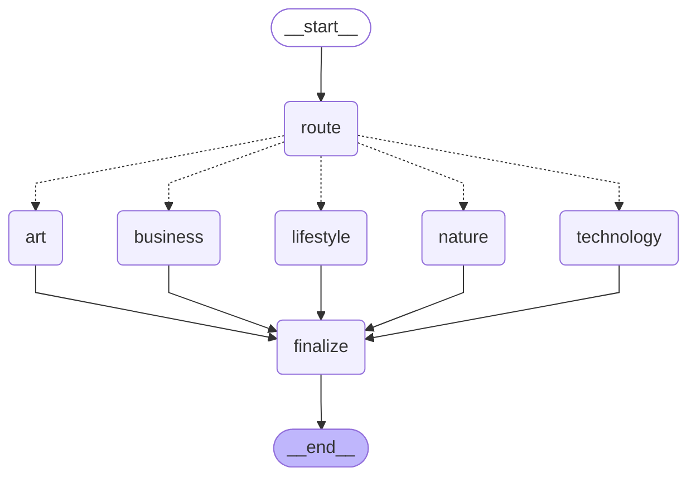

# ルーター型テーマ生成グラフ構造

```mermaid
---
config:
  flowchart:
    curve: linear
---
graph TD;
	__start__([<p>__start__</p>]):::first
	route(route)
	technology(technology)
	art(art)
	business(business)
	nature(nature)
	lifestyle(lifestyle)
	finalize(finalize)
	__end__([<p>__end__</p>]):::last
	__start__ --> route;
	art --> finalize;
	business --> finalize;
	lifestyle --> finalize;
	nature --> finalize;
	route -.-> art;
	route -.-> business;
	route -.-> lifestyle;
	route -.-> nature;
	route -.-> technology;
	technology --> finalize;
	finalize --> __end__;
	classDef default fill:#f2f0ff,line-height:1.2
	classDef first fill-opacity:0
	classDef last fill:#bfb6fc

```
