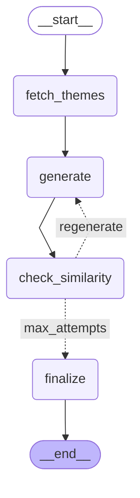

# テーマ生成グラフ構造

```mermaid
---
config:
  flowchart:
    curve: linear
---
graph TD;
	__start__([<p>__start__</p>]):::first
	fetch_themes(fetch_themes)
	generate(generate)
	check_similarity(check_similarity)
	finalize(finalize)
	__end__([<p>__end__</p>]):::last
	__start__ --> fetch_themes;
	check_similarity -. &nbsp;max_attempts&nbsp; .-> finalize;
	check_similarity -. &nbsp;regenerate&nbsp; .-> generate;
	fetch_themes --> generate;
	generate --> check_similarity;
	finalize --> __end__;
	classDef default fill:#f2f0ff,line-height:1.2
	classDef first fill-opacity:0
	classDef last fill:#bfb6fc

```
